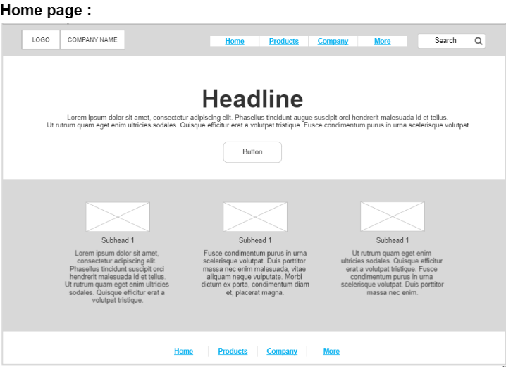
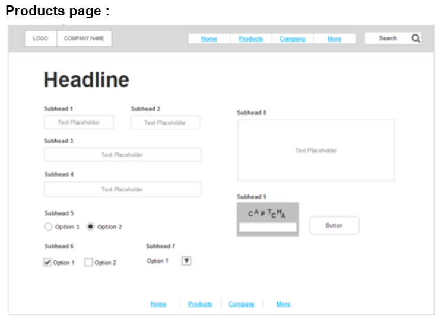
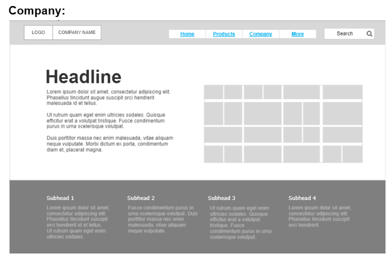
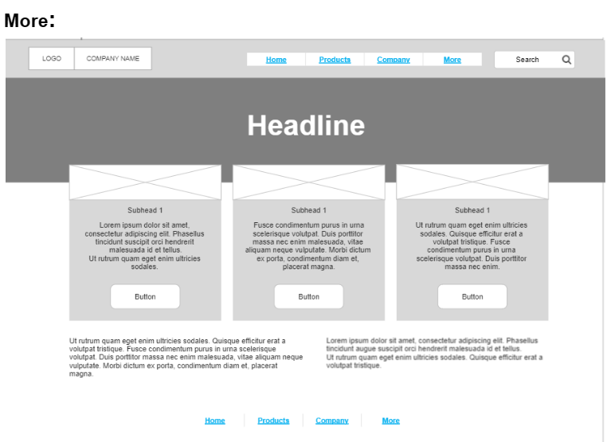

# wireframe2website

# Intrudaction
We will learn how to convert a wireframe website to a HTML code 

## What we will use?
+ VS code application in order to write the code
+ The needed pages that need to be converted

*Kindly check the attached pictures that explain the pages that will be converted into HTML :
+ 
+ 
+ 
+ 

